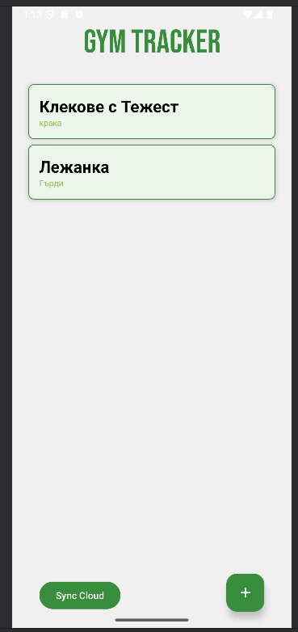
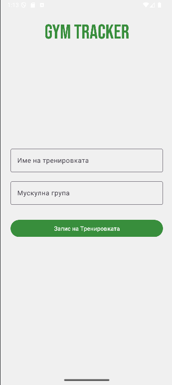
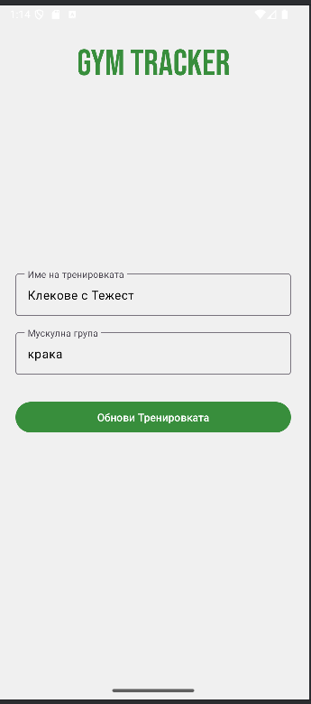
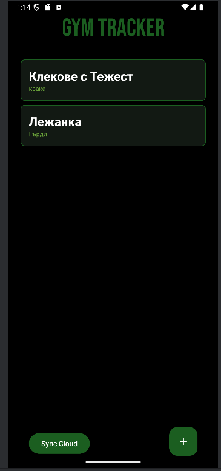
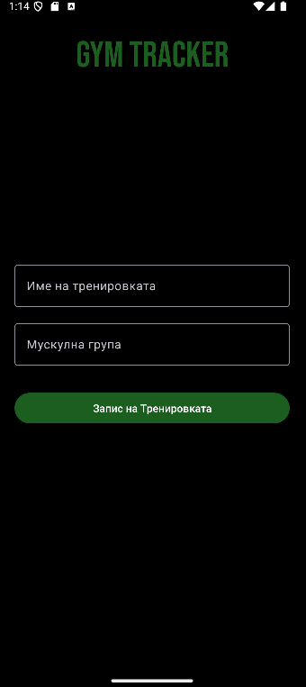

# 🏋️ GymTracker: Приложение за Следене на Тренировки

Това е мобилно приложение, разработено на Kotlin/Android, което позволява на потребителите да записват своите тренировки и да ги синхронизират със сървър в облака.

## 💡 Идея

Основната идея на GymTracker е да предостави лесен и ефективен начин за водене на дневник на тренировките. Потребителят може да въвежда име на упражнението, мускулна група и други параметри. Ключов елемент е надеждната двупосочна синхронизация, която осигурява достъп до данните както офлайн (чрез локална база данни), така и на други устройства (чрез облака).

---

## 🧠 Как Работи (Прост Потребителски Поток и Синхронизация)

Приложението работи по два основни начина: **Офлайн (Локални данни)** и **Синхронизация с Облака**.

### 1. Локално Съхранение

Всички потребителски данни (тренировки) се съхраняват локално в база данни **Room** (SQLite). Това позволява на приложението да работи напълно офлайн.

### 2. Двупосочна Синхронизация

При натискане на бутона "Синхронизиране с облака" (`syncCloud()`), се изпълняват две стъпки, гарантиращи, че няма дубликати:

#### А. Качване на Нови Записи (Upload)

Проверяват се всички локални тренировки, които **нямат** `apiId` (т.е., не са качени в облака).

- Тези записи се изпращат към външния API.
- При успешен отговор, локалният запис се **обновява** с новото `apiId`, получено от сървъра.

#### Б. Сваляне и Обновяване (Download)

Изтеглят се всички тренировки от облака (API). За всеки изтеглен запис се прави проверка:

- **Ако записът вече съществува** локално (по неговия `apiId`), той се **обновява** с новите данни от облака.
- **Ако записът е нов** (няма го локално), той се **вмъква** като нов запис в локалната база данни.

Този механизъм с проверка по `apiId` елиминира проблема с дублирането на данни.

---

## 🏗️ Архитектура

Приложението следва препоръчителната Android архитектура, базирана на **MVVM (Model-View-ViewModel)**.

- **View (Activities/Fragments):** Отговаря за показването на UI и изпращането на потребителски събития. Наблюдава `LiveData` от ViewModel.
- **ViewModel:** Съдържа логика, свързана с UI, и предоставя данни за View. Използва Repository.
- **Repository (`GymRepository`):** Единицата за достъп до данни. Тя решава дали данните да дойдат от:
  - **Local Data Source (Room/DAO):** Локална база данни.
  - **Remote Data Source (Retrofit/API):** Външният облачен сървър.

---

## 🗺️ Потребителски Поток

1.  **Старт:** Потребителят вижда списък с всички въведени тренировки (изтеглени от Room).
2.  **Добавяне:** Потребителят добавя нова тренировка. Тя се запазва **локално** с `apiId = null`.
3.  **Синхронизация:** Потребителят натиска "Sync Cloud".
    - Първо, новата тренировка се качва.
    - Второ, изтеглят се нови записи от външно API.
4.  **Детайли:** Потребителят може да редактира детайли и да изтрива тренировки.

---

## 🚀 Стъпки за Старт

1.  **Клониране:** Клонирайте репозиторито:
    ```bash
    git clone  https://github.com/NikolaiChalakov/gymtracker.git
    ```
2.  **Android Studio:** Отворете проекта в Android Studio.
3.  **Зависимости:** Изчакайте Gradle да синхронизира всички зависимости (Room, Retrofit, Coroutines).
4.  **Стартиране:** Изберете емулатор или физическо устройство и натиснете бутона **Run** (зелената стрелка).

---

## 🔑 Тестови Акаунти

Тъй като приложението използва MockAPI, не са необходими потребителски акаунти или пароли. Всички данни се изпращат и получават анонимно.

---

## 📸 Скрийншотове







---

## 📦 APK

<a href="https://raw.githubusercontent.com/NikolaiChalakov/gymtracker/main/app/release/GymTracker.apk" download>
  <strong>⬇️ Изтегли APK</strong>
</a>
